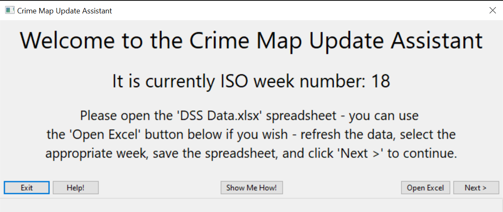

# Crime-Map-Update-Assistant

Source code for the Crime Map Update Assistant as described in TrackIT documentation.

## Dependencies

### OpenXLSX

&nbsp;&nbsp;&nbsp;&nbsp;*OpenXLSX is a C++ library for reading, writing, creating and modifying Microsoft Excel® files, with the .xlsx format.*
* [OpenXLSX GitHub Repository](https://github.com/troldal/OpenXLSX)

### wxWidgets

&nbsp;&nbsp;&nbsp;&nbsp;*wxWidgets is a C++ library that lets developers create applications for Windows, macOS, Linux and other platforms with a single code base.*
  * [wxWidgets.org](https://wiki.wxwidgets.org/Install)
